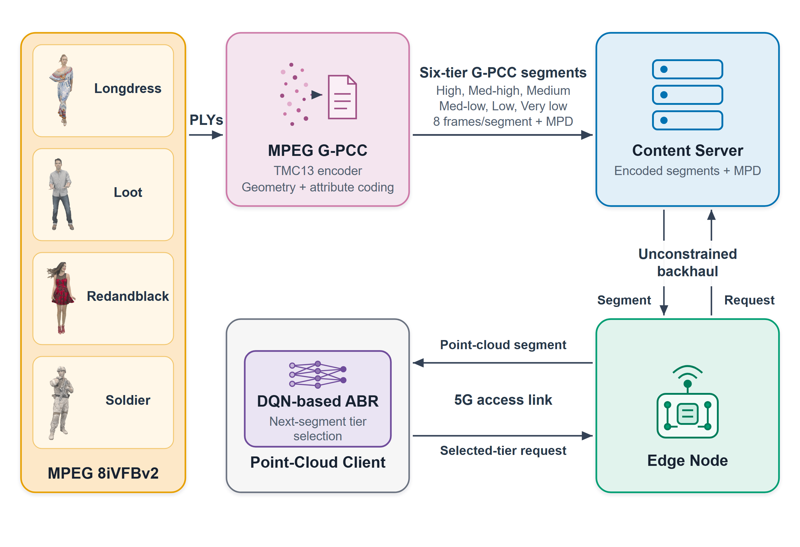
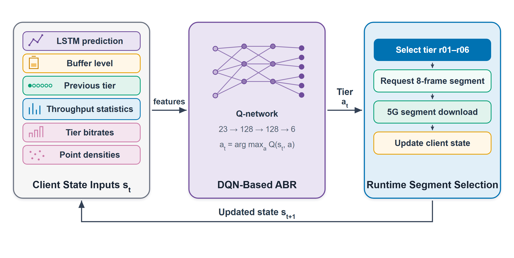
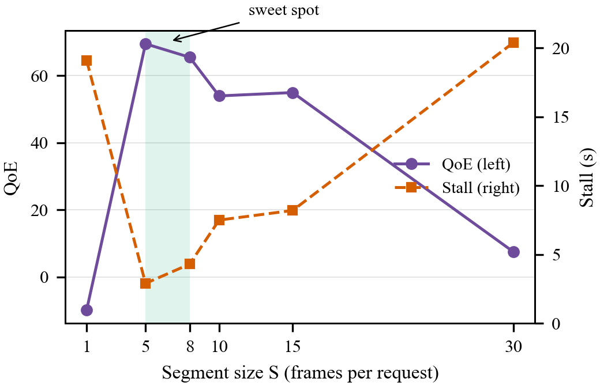
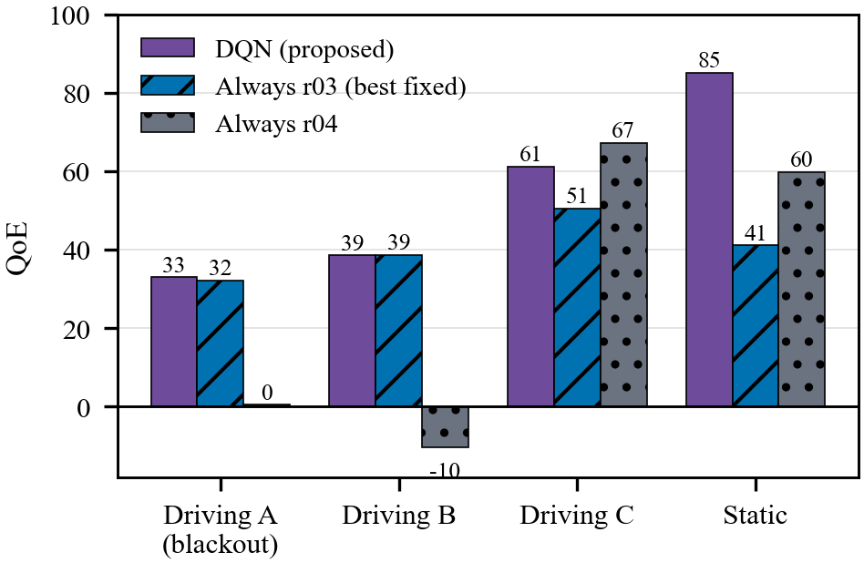
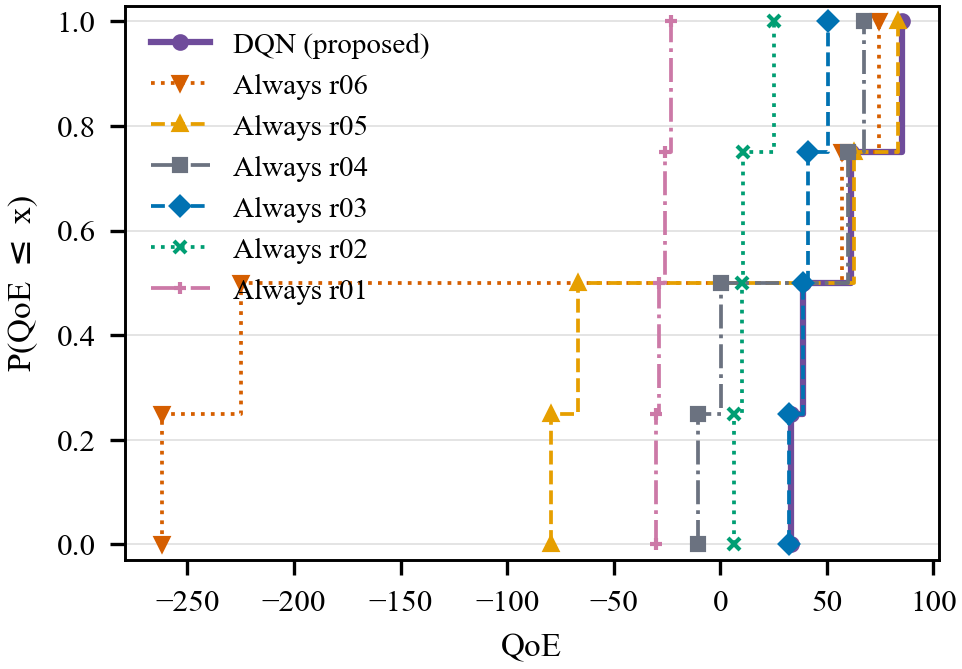
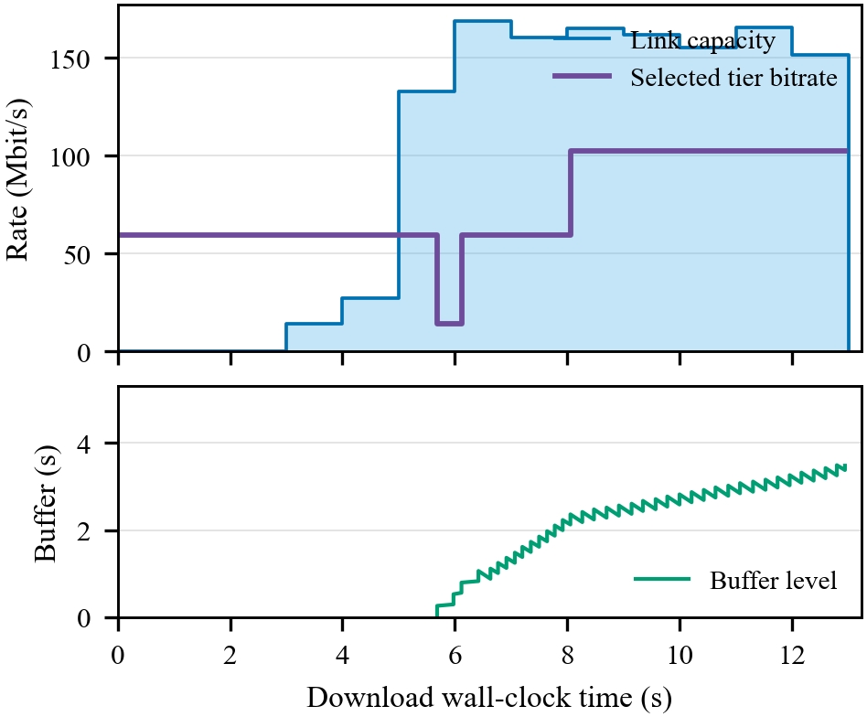
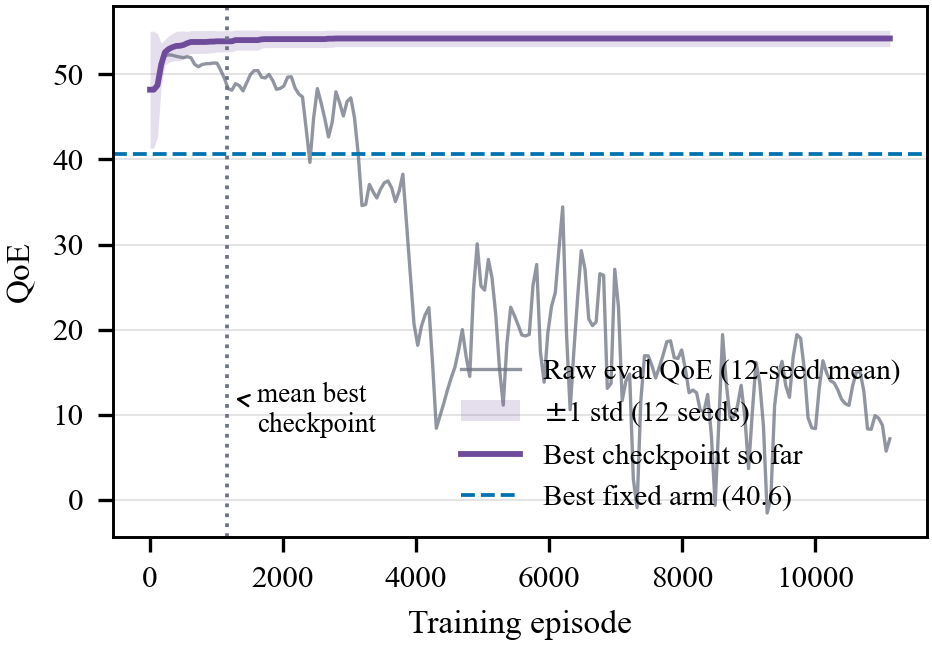

# Deep Reinforcement Learning-Based Adaptive Point Cloud Streaming over 5G Networks

**Authors:** *[Given Name Surname, dept., organization, City, Country, bura@panto.org — fill in]*

---

> **Draft status:** The method text reflects the aligned six-term objective, but
> all performance claims, tables, and plots still come from the superseded run.
> Replace them only after retraining and a newly registered evaluation.

## Abstract

Abstract—High-quality point clouds enable immersive volumetric media, but their extreme bandwidth demands make adaptive streaming over mobile networks an open challenge. This paper presents a learning-based adaptive bitrate (ABR) controller for point cloud streaming. Four sequences of the 8i Voxelized Full Bodies dataset are encoded with the MPEG Geometry-based Point Cloud Compression (G-PCC) reference codec into a six-tier quality ladder and streamed as DASH-style segments over a trace-driven 5G simulator built from a public Irish 5G dataset with its measured 72 ms round-trip time. We first show that per-frame fetching cannot sustain 30 frames per second at this latency, whereas segment-based fetching of 5 to 8 frames per request nearly eliminates stalling. A Double Deep Q-Network agent is then trained with the same six-term objective used for evaluation: normalized quality minus stall duration, rebuffering-event frequency, segment-quality changes, dropped frames, and startup delay. [Replace this sentence with the revised held-out results after retraining and newly registered evaluation.]

**Keywords**—point cloud streaming, adaptive bitrate, deep reinforcement learning, G-PCC, MPEG-DASH, 5G, quality of experience

---

## I. Introduction

Immersive volumetric media, such as holographic telepresence and augmented reality, are among the flagship services envisioned for 5G networks and beyond. Dynamic 3D point clouds are a natural representation for such media: each frame is a set of colored points that can be rendered from any viewpoint. Uncompressed, a single high-quality human-body sequence at 30 frames per second (fps) can exceed 6 Gbit/s [2]. Even after compression with the MPEG Geometry-based Point Cloud Compression standard (G-PCC) [4], [5], the highest quality tier used in this work requires 102.4 Mbit/s, which a mobile 5G link can deliver on average but not at every instant.

Dynamic Adaptive Streaming over HTTP (DASH) [1] addresses throughput variability by encoding content at multiple quality levels and letting the client select a level per segment. Hosseini and Timmerer extended this concept to point clouds with DASH-PC [3], using spatial sub-sampling to generate density representations. Their adaptation logic, like most deployed ABR schemes, is rule-based. For video, learning-based controllers such as Pensieve [6] have shown that a policy trained with reinforcement learning (RL) can outperform hand-crafted rules. Applying this idea to G-PCC point cloud streaming raises specific challenges: the rate ladder spans two orders of magnitude, perceived quality is governed by point density rather than pixel fidelity, and the interaction between the 5G round-trip time (RTT) and the request granularity determines whether stall-free playback is possible at all.

This paper makes four contributions. First, a complete open simulation pipeline that streams real G-PCC bitstreams (six-tier ladder, four 8i Voxelized Full Bodies sequences [2]) over a trace-driven 5G channel with a TCP model whose serialization time is the exact integral of the measured time-varying capacity. Second, a quantitative analysis of segment size showing an inverted-U quality-of-experience (QoE) curve: per-frame fetching is RTT-bound while very large segments react too slowly to fades. Third, a Double Deep Q-Network (DQN) [10] ABR agent trained on a perceptual quality-aware reward. Fourth, a robust 12-seed evaluation on held-out traces in which the learned policy beats the best fixed-quality arm by 13.9 QoE points with a seed standard deviation below 1.

## II. Related Work

### A. Point cloud compression and streaming

MPEG standardized two point cloud codecs: V-PCC, which projects the cloud onto video planes, and G-PCC, which codes geometry directly with octrees and attributes with hierarchical transforms [4], [5]. G-PCC exposes rate control through the geometry position quantization scale and the attribute quantization parameter (QP); it has no target-bitrate mode, so a bitrate ladder must be built from parameter pairs. DASH-PC [3] pioneered manifest-driven adaptive point cloud streaming with density sub-sampling. Van der Hooft et al. proposed PCC-DASH [8], rate-adapting V-PCC streams with heuristic policies. Our work differs by using standard G-PCC bitstreams and by replacing heuristic adaptation with a learned policy.

### B. Learning-based bitrate adaptation

Rule-based ABR uses throughput estimates [7] or buffer occupancy; Pensieve [6] showed that an RL policy trained in simulation generalizes across network conditions and outperforms such rules for 2D video. Its reward, quality minus rebuffering and quality switching, has become standard. We adopt this structure, distinguish rebuffering duration from event frequency, replace the quality term with a log-density utility suited to point clouds, and include frame-drop and startup-delay costs.

### C. 5G measurement datasets

Raca et al. published a 5G dataset with throughput, latency, and context metrics collected on a commercial Irish network [9]. We use its saturated-download traces as the access-link capacity signal and its measured ping (median 72 ms in 5G mode) as the RTT, rather than assuming idealized values.

## III. System Model

### A. Architecture

Fig. 1 shows the system. Four 8iVFBv2 sequences (longdress, loot, redandblack, soldier; 300 frames, 30 fps) are encoded offline by the G-PCC reference encoder (TMC13) into six representations and stored on a content server together with a DASH-style media presentation description (MPD). An edge node fetches segments from the server across an unconstrained backhaul and serves the client over the bottleneck 5G access link. The client runs the ABR controller: it observes only its playback buffer and the achieved throughput of completed downloads (never the true link capacity) and requests one segment of S consecutive frames per decision.

*Fig. 1. System architecture: G-PCC encoding, content server, unconstrained backhaul, edge node, and the 5G access link to the DQN-driven point cloud client.*

### B. Content and quality ladder

Table I lists the ladder. Geometry follows the MPEG common test condition rate points (position quantization scale 1.0 down to 0.125) paired with attribute QP 22 to 51. The simulator transfers the exact coded size of every frame, so all results reflect real G-PCC rate characteristics.

**TABLE I. Six-Tier G-PCC Quality Ladder (Longdress)**

| Tier | Pos. scale | Attr. QP | Bitrate (Mbit/s) | Points (frame 0) |
|---|---|---|---|---|
| r06 (high) | 1.000 | 22 | 102.4 | 765,821 |
| r05 | 0.875 | 28 | 59.6 | 602,139 |
| r04 | 0.750 | 34 | 35.5 | 453,698 |
| r03 | 0.500 | 40 | 14.1 | 212,105 |
| r02 | 0.250 | 46 | 3.4 | 55,374 |
| r01 (very low) | 0.125 | 51 | 0.9 | 14,057 |

Perceived quality is modeled as a log-density utility, reflecting the diminishing perceptual return of additional points:

> q(r) = [log d(r) − log d_min] / [log d_max − log d_min]    (1)

where d(r) is the decoded point count of representation r and d_min, d_max are the ladder endpoints, so q ranges from 0 (r01) to 1 (r06).

### C. Network and transport model

The access link is driven by 21 saturated-download traces of the Irish 5G dataset [9] (5 static, 16 driving; about 11.4 h in total), split with a fixed seed into 17 training and 4 held-out traces (3 driving, 1 static; one held-out driving trace contains a genuine 137 s coverage blackout). A TCP connection with slow start, additive-increase multiplicative-decrease, and the dataset-derived 72 ms RTT carries every transfer. Capacity is re-queried every RTT round, and serialization time is computed as the exact integral of the piecewise-constant capacity, so a download traverses the trace instead of freezing a single sample. The client buffer holds 5 s, playback starts after 1 s has been buffered, and playback then runs at a fixed 30 fps; an empty buffer causes rebuffering.

### D. Segment-based fetching

Each ABR decision requests S consecutive frames as one HTTP transfer, amortizing the RTT. At S = 1 every 33 ms frame pays a 72 ms round trip, so no tier can sustain 30 fps; at very large S the controller cannot react to mid-segment fades. Section V quantifies this trade-off; S = 8 is used for the final system.

## IV. DQN-Based Bitrate Adaptation

### A. State, action, and decision flow

Fig. 2 shows the runtime decision flow. The 23-dimensional state contains an LSTM one-step bandwidth prediction (1), the buffer level (1), the previous tier as a one-hot vector (6), the last, mean, and standard deviation of the five most recent achieved-throughput samples (3), and the per-tier bitrates (6) and log point densities (6) taken from the manifest. All features are normalized with constants stored in the model checkpoint, so training and inference can never diverge. The action selects one of the six tiers for the next 8-frame segment.

*Fig. 2. Runtime decision flow of the client-side DQN controller: the 23-feature state is mapped by the Q-network to a tier for the next 8-frame segment; the download outcome updates the state.*

### B. Reward

Training and evaluation use exactly the same additive objective. Let \(S_t\) contain the \(n_t\) frames requested in segment \(t\), let \(N\) be the episode's total frame count, and let \(q_{t,i}\in[0,1]\) and \(\bar q_t\) denote the frame utility and segment-mean utility, respectively. The per-segment reward is

> r_t = (100/N)·Σ_{i∈S_t}q_{t,i} − 4.3·ΔT_stall,t − 2·ΔN_rebuf,t − |q̄_t−q̄_{t−1}| − (100/N)·ΔN_drop,t − ΔT_start,t    (2)

The first segment has zero quality-change cost. Stall duration is linear and uncapped. With discount factor \(\gamma=1\) and no learner-side reward scaling, the episodic return is therefore identical to the reported QoE:

> QoE = Σ_t r_t = 100·q̄ − 4.3·T_stall − 2·N_rebuf − Σ_{t=2}^{K}|q̄_t−q̄_{t−1}| − (100/N)·N_drop − T_start    (3)

Here \(T_start\) is measured from session time zero until playback begins for the first time. It then freezes permanently. In contrast, \(T_stall\) and \(N_rebuf\) accumulate only after playback has begun, respectively measuring the duration and number of buffer-underflow interruptions. Initial buffering is thus charged only as startup delay and can never also be a stall or rebuffering event. \(N_drop\) is the number of buffer-overflow frame drops. Raw network parameters deliberately do not appear: QoE measures only user-observable outcomes.

### C. Learning algorithm

The agent is a Double DQN [10] with experience replay. The Q-network is a multilayer perceptron (23-128-128-6, ReLU). Hyperparameters: discount 1.0, Adam with learning rate 0.0001, batch size 64, replay buffer 100,000 transitions, target-network synchronization every 3,000 learning steps, and an epsilon-greedy schedule from 1.0 to 0.05 over 60% of training. Each run trains 20 epochs over the 17 training traces with all four content sequences rotating; the best checkpoint is selected by held-out QoE. Training a single seed takes under one hour on a desktop CPU.

## V. Evaluation

> **Revision note:** The numerical results and plots below were produced with the superseded objective and must be regenerated after retraining with (2)–(3). They must not be reported as results of the aligned six-term objective.

### A. Setup

All results are measured on the four held-out traces (never seen in training) with the longdress sequence, three evaluation seeds, and the metric of (3). Baselines are the six fixed-tier policies (always request tier k) and, for context, the rule-based controllers of the simulator, which remain pinned near the lowest tier because their throughput estimates are RTT-biased on small transfers.

### B. Effect of segment size

Fig. 5 reports the segment-size sweep (measured on the static-trace regime with the metric of (3) without its startup and drop terms, which were introduced later). The curve is a clear inverted U. At S = 1 the per-frame RTT causes 19 s of stalling per 10 s clip; at S = 30 only 10 decisions per clip remain and mid-segment fades again cause 20 s of stalling despite the highest mean quality (0.958). S = 5 to 8 (shaded) nearly eliminates stalling while retaining fine-grained adaptation.

*Fig. 5. Effect of segment size S: QoE (left axis, solid) and stall time (right axis, dashed) on the held-out static trace. Both extremes fail for opposite reasons; the shaded band marks the S = 5–8 sweet spot.*

### C. Main results

Absolute scores on this metric must be read against two facts. First, 100 corresponds to stall-free playback at the highest tier with no switching, an operating point the driving traces physically cannot support: measured capacity crosses the quality ladder 57 to 76 percent of the time, so even an oracle policy must ride the middle tiers through fades. Second, one held-out trace contains a genuine 137 s coverage blackout during which no policy can deliver frames; the best achievable score on that trace is about 33, which bounds the four-trace mean for every policy, learned or fixed. The meaningful quantity is therefore the margin over the strongest baseline on identical traces, reported next.

Table II compares the trained DQN against every fixed arm on the four held-out traces. No static tier works across the mixed regime: the top tier stalls 76 s per clip on the driving traces, the bottom tier delivers 3% of the quality utility, and the best compromise (always r03) reaches a QoE of 40.6. The DQN reaches 54.5 with a 12-seed standard deviation of only 0.95, beating the best fixed arm by 13.9 points.

**TABLE II. Held-Out Results: Fixed Arms vs. Learned Policy**

| Policy | QoE | Mean quality | Stall (s) |
|---|---|---|---|
| Always r06 (102.4 Mbit/s) | −88.8 | 0.978 | 76.2 |
| Always r05 (59.6 Mbit/s) | 0.0 | 0.921 | 35.3 |
| Always r04 (35.5 Mbit/s) | 29.3 | 0.854 | 16.9 |
| Always r03 (14.1 Mbit/s) | 40.6 | 0.674 | 3.3 |
| Always r02 (3.4 Mbit/s) | 13.0 | 0.356 | 0.0 |
| Always r01 (0.9 Mbit/s) | −27.0 | 0.030 | 0.0 |
| **DQN (12-seed mean ± std)** | **54.5 ± 0.95** | **0.775** | **1.8** |

The per-trace breakdown (Fig. 3) shows where the learned policy wins. On the trace containing a 137 s coverage blackout the DQN ties the best fixed arm (33.0 vs. 32.2): nothing can stream through a blackout, and the safe policy is matched. On the favorable static trace the DQN more than doubles the best fixed arm (85.1 vs. 41.1) by riding the high tiers whenever capacity allows while the fixed arm stays at its compromise tier. Fig. 3 also exposes why no *other* fixed arm can bridge the gap: always-r04 wins Driving C (67.3) but collapses to 0.5 and −10.4 on the two hardest traces — a fixed tier that exploits good conditions is not safe, and the safe tier cannot exploit. This asymmetry, matching the safe policy in the worst case while exploiting headroom in the good case, is precisely the value proposition of learned adaptation.

*Fig. 3. QoE per held-out trace: the DQN (12-seed mean) against the two strongest fixed arms. The DQN matches the safe arm under the blackout and more than doubles it on the static trace; always-r04 wins one trace but fails the hard ones.*

Fig. 6 summarizes the same comparison distributionally: the empirical CDF of QoE over the held-out traces. The DQN curve lies to the right of every fixed arm across the entire probability range — it stochastically dominates all six — while the aggressive arms (r05, r06) exhibit catastrophic left tails (QoE below −80) on the driving traces.

*Fig. 6. Empirical CDF of QoE across the four held-out traces for each strategy. The DQN stochastically dominates every fixed arm; the high fixed tiers show catastrophic left tails.*

Fig. 4 illustrates the learned behavior itself on the held-out static trace. The policy begins one tier below the maximum while the link attaches, briefly drops to r03 as the first throughput measurements arrive, then commits to the top tier once the measured capacity sustains it — building the buffer monotonically and completing the entire clip without a single stall.

*Fig. 4. DQN adaptation on the held-out static trace: link capacity and selected tier bitrate (top), client buffer level (bottom). The policy climbs to the top tier as soon as measured throughput allows and streams stall-free.*

### D. Ablations and robustness

Two ablations are settled null results. First, removing the LSTM prediction from the state changes QoE by less than 1.1 points: the throughput history statistics already carry the usable signal, although the feature is retained in the shipped model. Second, training with or without the startup and drop reward terms of (2) yields no outcome difference, because avoiding slow startups and drops already maximizes quality-time; the extended reward is kept as it aligns the objective with the reported metric at zero cost. Finally, the 12-seed standard deviation of 0.95 (per-seed range 51.9 to 55.3) shows that the result is not a lucky checkpoint; decoupling the trace split from the training seed and evaluating on four traces were the key steps that removed an earlier twenty-point seed variance.

Fig. 7 examines training convergence. The best-checkpoint QoE rises within the first tenth of training (mean best checkpoint at episode 1,158 of 11,120) and then locks onto its plateau: additional episodes yield no further improvement across any of the 12 seeds. The raw evaluation curve drifts downward later in training — the well-known DQN over-training effect — which the best-checkpoint selection used throughout this work renders harmless. Training longer is therefore unnecessary; convergence is fast and definitively bracketed.

*Fig. 7. Held-out QoE during training (winner configuration, 12 seeds). The best-checkpoint curve converges within the first ~10% of episodes and stays locked; raw evaluations later degrade, motivating best-checkpoint selection.*

## VI. Conclusion

This paper demonstrated end-to-end learned bitrate adaptation for G-PCC point cloud streaming over measured 5G conditions. Segment-based fetching of 5 to 8 frames per request resolves the RTT bound that makes per-frame streaming infeasible at 72 ms latency, and a Double DQN trained on a quality-aware reward outperforms every fixed-quality policy by 13.9 QoE points on held-out traces, with seed variance below 1 QoE point. The learned policy matches the safest fixed policy under a coverage blackout and doubles it when capacity allows. Future work includes multi-user streaming over a shared bottleneck, viewport-aware tiling, and request pacing for the rule-based baselines.

## Acknowledgment

The authors thank the maintainers of the MPEG G-PCC reference software and the providers of the 8iVFBv2 and Irish 5G datasets.

## References

1. Information technology—Dynamic adaptive streaming over HTTP (DASH)—Part 1: Media presentation description and segment formats, ISO/IEC 23009-1, 2014.
2. E. d'Eon, B. Harrison, T. Myers, and P. A. Chou, "8i voxelized full bodies—a voxelized point cloud dataset," ISO/IEC JTC1/SC29 (MPEG/JPEG) input document m40059, Geneva, Jan. 2017.
3. M. Hosseini and C. Timmerer, "Dynamic adaptive point cloud streaming," in Proc. 23rd Packet Video Workshop, Amsterdam, Netherlands, 2018, pp. 25–30.
4. S. Schwarz et al., "Emerging MPEG standards for point cloud compression," IEEE J. Emerg. Sel. Topics Circuits Syst., vol. 9, no. 1, pp. 133–148, Mar. 2019.
5. Information technology—Coded representation of immersive media—Part 9: Geometry-based point cloud compression, ISO/IEC 23090-9, 2023.
6. H. Mao, R. Netravali, and M. Alizadeh, "Neural adaptive video streaming with Pensieve," in Proc. ACM SIGCOMM, Los Angeles, CA, USA, 2017, pp. 197–210.
7. X. Yin, A. Jindal, V. Sekar, and B. Sinopoli, "A control-theoretic approach for dynamic adaptive video streaming over HTTP," in Proc. ACM SIGCOMM, London, U.K., 2015, pp. 325–338.
8. J. van der Hooft, T. Wauters, F. De Turck, C. Timmerer, and H. Hellwagner, "Towards 6DoF HTTP adaptive streaming through point cloud compression," in Proc. 27th ACM Int. Conf. Multimedia, Nice, France, 2019, pp. 2405–2413.
9. D. Raca, D. Leahy, C. J. Sreenan, and J. J. Quinlan, "Beyond throughput, the next generation: a 5G dataset with channel and context metrics," in Proc. 11th ACM Multimedia Syst. Conf. (MMSys), Istanbul, Turkey, 2020, pp. 303–308.
10. H. van Hasselt, A. Guez, and D. Silver, "Deep reinforcement learning with double Q-learning," in Proc. 30th AAAI Conf. Artif. Intell., Phoenix, AZ, USA, 2016, pp. 2094–2100.
11. S. S. Krishnan and R. K. Sitaraman, "Video stream quality impacts viewer behavior: inferring causality using quasi-experimental designs," IEEE/ACM Trans. Netw., vol. 21, no. 6, pp. 2001–2014, Dec. 2013.
